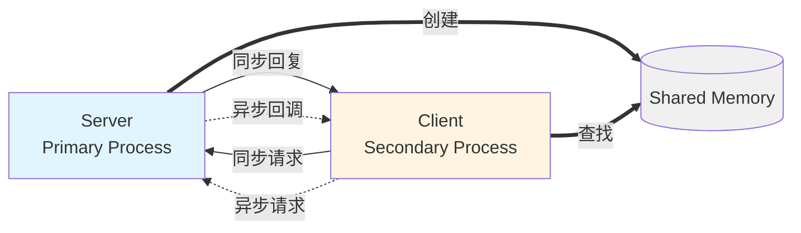
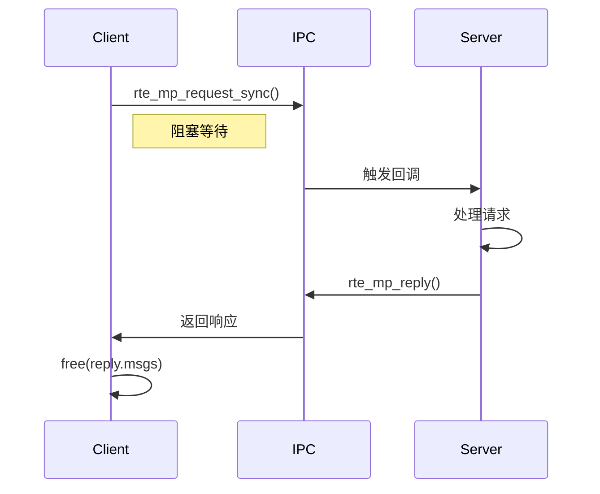
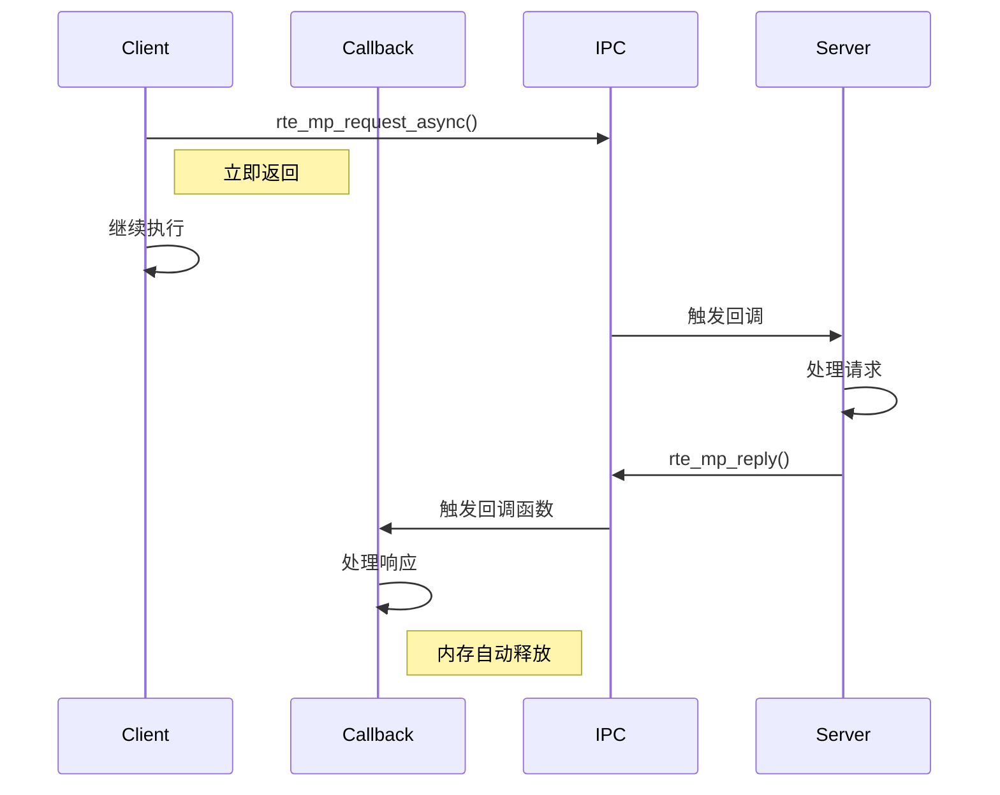

# DPDK 多进程 IPC 通信

## 目录

- [一、IPC 概述](#一ipc-概述)
- [二、核心数据结构](#二核心数据结构)
- [三、核心 API 详解](#三核心-api-详解)
- [四、实战示例](#四实战示例)
- [五、参考资料](#五参考资料)

---

# 一、IPC 概述

## 1.1 什么是 DPDK IPC

在DPDK多进程架构中，除了通过共享内存和Ring队列传递数据包，还需要一种机制来传递控制消息和元数据。DPDK提供了原生的IPC (Inter-Process Communication) API来实现这一功能。

**官方文档参考:**
https://doc.dpdk.org/guides-19.05/prog_guide/multi_proc_support.html (第34.4节)

## 1.2 通信模式

DPDK IPC支持两种通信模式:

- **单播(Unicast)**: 从进程(Secondary)向主进程(Primary)发送消息
- **广播(Broadcast)**: 主进程向所有从进程发送消息

## 1.3 消息类型

DPDK IPC提供四种消息类型:

| 类型 | 说明 |
|------|------|
| **MP_MSG** | 单向消息，不需要响应的"尽力而为"的通知机制 |
| **MP_REQ** | 同步请求，需要等待对方回复的双向通信，会阻塞等待 |
| **MP_REP** | 对之前接收到的请求的响应 |
| **MP_IGN** | 告诉请求者忽略此响应 |

## 1.4 API 列表

| API函数 | 功能说明 |
|---------|---------|
| `rte_mp_disable` | 禁用多进程IPC |
| `rte_mp_action_register` | 注册消息处理回调函数 |
| `rte_mp_action_unregister` | 注销消息处理回调函数 |
| `rte_mp_sendmsg` | 发送单向消息(不等待响应) |
| `rte_mp_request_sync` | 发送同步请求(阻塞等待响应) |
| `rte_mp_request_async` | 发送异步请求(非阻塞,通过回调获取响应) |
| `rte_mp_reply` | 在回调函数中回复请求 |

---

# 二、核心数据结构

## 2.1 rte_mp_msg - 消息结构体

这是IPC通信的核心数据结构，用于封装所有类型的消息:

```c
struct rte_mp_msg {
    char name[RTE_MP_MAX_NAME_LEN];        // 消息名称(最大64字节)
    int len_param;                         // param字段的有效数据长度
    int num_fds;                           // fds数组中有效文件描述符的个数
    uint8_t param[RTE_MP_MAX_PARAM_LEN];  // 消息参数数据(最大256字节)
    int fds[RTE_MP_MAX_FD_NUM];           // 文件描述符数组(最多8个)
};
```

**字段说明:**

- `name`: 消息的唯一标识符，接收方通过这个名称来匹配对应的回调函数
- `len_param`: 指定param中实际存储的数据长度，最大256字节
- `num_fds`: 指定需要传递的文件描述符个数，最大8个
- `param`: 存放消息的参数数据，可以是任意二进制数据
- `fds`: 用于在进程间传递文件描述符(如设备fd、eventfd等)

## 2.2 rte_mp_reply - 响应结构体

用于存储同步/异步请求的响应结果:

```c
struct rte_mp_reply {
    int nb_sent;              // 请求发送出去的消息个数
    int nb_received;          // 实际收到回复的消息个数
    struct rte_mp_msg *msgs;  // 存放收到的回复消息数组
};
```

**使用注意:**

- `nb_sent`: 请求发送给了多少个进程(广播时可能多个)
- `nb_received`: 实际收到了多少个响应(可能因超时小于nb_sent)
- `msgs`: **同步请求**需要调用者手动 `free()`，**异步请求**自动管理

---

# 三、核心 API 详解

## 3.1 rte_mp_action_register - 注册消息处理器

```c
int rte_mp_action_register(const char *name, rte_mp_t action);
```

**功能:** 注册一个回调函数来处理指定名称的消息

**参数:**
- `name`: 消息名称，用于标识这类消息(最大64字节)
- `action`: 回调函数指针，签名为 `int (*)(const struct rte_mp_msg *msg, const void *peer)`

**返回值:**
- `0`: 成功
- `-1`: 失败(可能是名称已被注册)

**示例:**

```c
// 定义消息处理回调函数
static int handle_request(const struct rte_mp_msg *msg, const void *peer)
{
    printf("收到请求: %s\n", (char *)msg->param);

    // 构造回复
    struct rte_mp_msg reply;
    memset(&reply, 0, sizeof(reply));
    strlcpy(reply.name, msg->name, sizeof(reply.name));  // 必须与请求名称相同!
    strlcpy((char *)reply.param, "OK", sizeof(reply.param));
    reply.len_param = 3;

    return rte_mp_reply(&reply, peer);
}

// 注册
if (rte_mp_action_register("my_request", handle_request) < 0) {
    printf("注册失败\n");
}
```

## 3.2 rte_mp_sendmsg - 发送单向消息

```c
int rte_mp_sendmsg(struct rte_mp_msg *msg);
```

**功能:** 发送单向消息，不等待响应(fire-and-forget)

**参数:**
- `msg`: 要发送的消息

**返回值:**

- `0`: 成功
- `<0`: 失败

**示例:**

```c
struct rte_mp_msg msg;
memset(&msg, 0, sizeof(msg));

strlcpy(msg.name, "notify_event", sizeof(msg.name));
uint32_t event = EVENT_LINK_UP;
memcpy(msg.param, &event, sizeof(event));
msg.len_param = sizeof(event);

if (rte_mp_sendmsg(&msg) < 0) {
    printf("发送失败\n");
}
```

## 3.3 rte_mp_request_sync - 发送同步请求

```c
int rte_mp_request_sync(struct rte_mp_msg *req,
                        struct rte_mp_reply *reply,
                        const struct timespec *ts);
```

**功能:** 发送请求并**阻塞等待**响应

**参数:**
- `req`: 请求消息
- `reply`: 用于存储响应的结构体
- `ts`: 超时时间，NULL表示使用默认超时(5秒)

**返回值:**
- `0`: 成功
- `<0`: 失败

**示例:**

```c
struct rte_mp_msg req;
struct rte_mp_reply reply;
struct timespec ts = {.tv_sec = 5, .tv_nsec = 0};

memset(&req, 0, sizeof(req));
strlcpy(req.name, "get_stats", sizeof(req.name));

// 发送同步请求
if (rte_mp_request_sync(&req, &reply, &ts) == 0) {
    if (reply.nb_received > 0) {
        printf("收到回复: %s\n", (char *)reply.msgs[0].param);
        free(reply.msgs);  // ⚠️ 必须释放内存
    }
}
```

## 3.4 rte_mp_request_async - 发送异步请求

```c
int rte_mp_request_async(struct rte_mp_msg *req,
                         const struct timespec *ts,
                         rte_mp_async_reply_t clb);
```

**功能:** 发送请求并**立即返回**，通过回调函数接收响应

**参数:**
- `req`: 请求消息
- `ts`: 超时时间
- `clb`: 回调函数，签名为 `int (*)(const struct rte_mp_msg *req, const struct rte_mp_reply *reply)`

**返回值:**
- `0`: 成功
- `<0`: 失败

**示例:**

```c
// 定义异步回调
static int async_callback(const struct rte_mp_msg *req,
                          const struct rte_mp_reply *reply)
{
    if (reply->nb_received > 0) {
        printf("异步回复: %s\n", (char *)reply->msgs[0].param);
        // ⚠️ 无需手动释放内存
    }
    return 0;
}

// 发送异步请求
struct rte_mp_msg req;
struct timespec ts = {.tv_sec = 5, .tv_nsec = 0};

memset(&req, 0, sizeof(req));
strlcpy(req.name, "get_stats", sizeof(req.name));

if (rte_mp_request_async(&req, &ts, async_callback) == 0) {
    printf("异步请求已发送\n");
    // 立即返回，不阻塞
}
```

## 3.5 rte_mp_reply - 回复请求

```c
int rte_mp_reply(struct rte_mp_msg *msg, const void *peer);
```

**功能:** 在回调函数中回复请求消息

**参数:**
- `msg`: 回复消息
- `peer`: 对端标识(从回调函数参数传入)

**返回值:**
- `0`: 成功
- `<0`: 失败

**⚠️ 重要**: 回复消息的 `name` 必须与请求消息的 `name` **完全相同**！

```c
// ❌ 错误
strlcpy(reply.name, "my_reply", sizeof(reply.name));

// ✅ 正确
strlcpy(reply.name, msg->name, sizeof(reply.name));
```

## 3.6 同步 vs 异步对比

| 特性 | 同步 (sync) | 异步 (async) |
|------|------------|--------------|
| API | `rte_mp_request_sync()` | `rte_mp_request_async()` |
| 阻塞行为 | ✅ 阻塞等待 | ❌ 立即返回 |
| 响应处理 | 直接获取 | 通过回调函数 |
| 内存管理 | ⚠️ 需要 `free(reply.msgs)` | ✅ 自动管理 |
| 适用场景 | 需要立即获取结果 | 不阻塞主流程 |

---

# 四、实战示例

## 4.1 示例概述

我们实现了一个演示同步和异步IPC通信的Hello-World示例。

**示例位置:** `8-multiprocess-msg/`

**架构图:**



## 4.2 核心数据结构

**common.h:**

```c
/* IPC消息名称定义 */
#define MSG_HELLO_REQUEST       "hello_request"
#define MSG_HELLO_ASYNC_REQUEST "hello_async_req"

/* 共享信息结构 */
struct shared_info {
    volatile uint32_t force_quit;
    uint64_t request_count;
    uint64_t async_request_count;
} __rte_cache_aligned;
```

## 4.3 Server 端实现

### 4.3.1 同步请求处理器

```c
static int handle_hello_request(const struct rte_mp_msg *msg, const void *peer)
{
    // 1. 解析请求
    char request_msg[MAX_MSG_LEN];
    memcpy(request_msg, msg->param, msg->len_param);
    printf("[SYNC] 收到: %s\n", request_msg);

    // 2. 更新共享内存
    struct shared_info *info = rte_memzone_lookup(MZ_SHARED_INFO)->addr;
    info->request_count++;

    // 3. 构造回复
    struct rte_mp_msg reply;
    memset(&reply, 0, sizeof(reply));
    strlcpy(reply.name, msg->name, sizeof(reply.name));  // 必须相同!
    snprintf((char *)reply.param, sizeof(reply.param),
             "Server SYNC reply: Got '%s'", request_msg);
    reply.len_param = strlen((char *)reply.param) + 1;

    // 4. 发送回复
    return rte_mp_reply(&reply, peer);
}
```

### 4.3.2 异步请求处理器

```c
static int handle_hello_async_request(const struct rte_mp_msg *msg, const void *peer)
{
    // 处理逻辑与同步类似
    // ...
    strlcpy(reply.name, msg->name, sizeof(reply.name));
    // ...
    return rte_mp_reply(&reply, peer);
}
```

### 4.3.3 主函数

```c
int main(int argc, char **argv)
{
    // 1. EAL初始化
    rte_eal_init(argc, argv);

    // 2. 创建共享内存
    init_shared_memory();

    // 3. 注册IPC处理器
    rte_mp_action_register(MSG_HELLO_REQUEST, handle_hello_request);
    rte_mp_action_register(MSG_HELLO_ASYNC_REQUEST, handle_hello_async_request);

    // 4. 主循环
    while (!force_quit) {
        // 每3秒打印统计
        usleep(100000);
    }

    // 5. 清理
    rte_mp_action_unregister(MSG_HELLO_REQUEST);
    rte_mp_action_unregister(MSG_HELLO_ASYNC_REQUEST);
    rte_eal_cleanup();
}
```

## 4.4 Client 端实现

### 4.4.1 异步回调函数

```c
static int async_reply_callback(const struct rte_mp_msg *request,
                                 const struct rte_mp_reply *reply)
{
    printf("[ASYNC] 回调被调用\n");

    for (int i = 0; i < reply->nb_received; i++) {
        printf("[ASYNC] 回复: %s\n", (char *)reply->msgs[i].param);
    }

    return 0;  // 内存自动管理
}
```

### 4.4.2 主函数

```c
int main(int argc, char **argv)
{
    // 1. EAL初始化
    rte_eal_init(argc, argv);

    // 2. 查找共享内存
    struct shared_info *info = rte_memzone_lookup(MZ_SHARED_INFO)->addr;

    // 3. 主循环
    while (!force_quit) {
        // 每3秒发送同步请求
        if (should_send_sync) {
            struct rte_mp_msg req;
            struct rte_mp_reply reply;
            struct timespec ts = {.tv_sec = 5};

            // 构造请求
            memset(&req, 0, sizeof(req));
            strlcpy(req.name, MSG_HELLO_REQUEST, sizeof(req.name));
            snprintf((char *)req.param, sizeof(req.param),
                     "SYNC Hello %u", sync_count++);
            req.len_param = strlen((char *)req.param) + 1;

            // 发送同步请求
            if (rte_mp_request_sync(&req, &reply, &ts) == 0) {
                if (reply.nb_received > 0) {
                    printf("[SYNC] 回复: %s\n", (char *)reply.msgs[0].param);
                    free(reply.msgs);  // 必须释放
                }
            }
        }

        // 每5秒发送异步请求
        if (should_send_async) {
            struct rte_mp_msg req;
            struct timespec ts = {.tv_sec = 5};

            memset(&req, 0, sizeof(req));
            strlcpy(req.name, MSG_HELLO_ASYNC_REQUEST, sizeof(req.name));
            snprintf((char *)req.param, sizeof(req.param),
                     "ASYNC Hello %u", async_count++);
            req.len_param = strlen((char *)req.param) + 1;

            // 发送异步请求
            if (rte_mp_request_async(&req, &ts, async_reply_callback) == 0) {
                printf("[ASYNC] 请求已发送\n");
            }
        }

        usleep(100000);
    }

    rte_eal_cleanup();
}
```

## 4.5 编译和运行

### 4.5.1 编译

```bash
cd 8-multiprocess-msg
mkdir build && cd build
cmake ..
make
```

### 4.5.2 运行

**终端1 - Server:**
```bash
cd build
sudo ./mp_server -l 0-1 -n 4 --proc-type=primary
```

**终端2 - Client:**
```bash
cd build
sudo ./mp_client -l 2-3 -n 4 --proc-type=secondary
```

### 4.5.3 预期输出

**Server:**
```
[SYNC] 收到: SYNC Hello 1 from Client
[Server] 已处理同步请求: 1 个, 异步请求: 0 个
[ASYNC] 收到: ASYNC Hello 1 from Client
[Server] 已处理同步请求: 1 个, 异步请求: 1 个
```

**Client:**
```
[SYNC] 回复: Server SYNC reply: Got 'SYNC Hello 1 from Client'
[ASYNC] 请求已发送
[ASYNC] 回调被调用
[ASYNC] 回复: Server ASYNC reply: Got 'ASYNC Hello 1 from Client'
```

## 4.6 时序图

### 4.6.1 同步请求流程



### 4.6.2 异步请求流程



## 4.7 关键要点

### ⚠️ 重要注意事项

1. **回复消息name必须与请求相同**
   ```c
   // ✅ 正确
   strlcpy(reply.name, msg->name, sizeof(reply.name));
   
   // ❌ 错误 - 会导致 "Drop mp reply" 错误
   strlcpy(reply.name, "other_name", sizeof(reply.name));
   ```

2. **内存管理**
   - 同步: 必须 `free(reply.msgs)`
   - 异步: 自动管理，无需释放

3. **file-prefix必须相同**
   ```bash
   # Server和Client必须使用相同的file-prefix
   --file-prefix=mp_ipc
   ```

4. **启动顺序**
   - 必须先启动Primary，再启动Secondary

### 🎯 代码统计

| 文件 | 行数 | 说明 |
|------|------|------|
| common.h | 40 | 共享数据结构 |
| server.c | 228 | Server实现 |
| client.c | 184 | Client实现 |
| CMakeLists.txt | 65 | CMake构建 |
| **总计** | **517** | 完整IPC演示 |

## 4.8 扩展练习

1. **增加消息类型**: 添加 `ping_request` 消息
2. **传递结构体**: 在 `param` 中传递自定义结构体
3. **多个Client**: 同时运行多个Client观察行为
4. **单向消息**: 使用 `rte_mp_sendmsg()` 实现通知
5. **超时处理**: 修改超时参数观察行为
6. **错误处理**: Server未启动时发送请求

---

# 五、参考资料

**DPDK官方文档:**
- https://doc.dpdk.org/guides-19.05/prog_guide/multi_proc_support.html

**扩展阅读:**
- [DPDK进程间通信以及在内存管理的应用](https://zhuanlan.zhihu.com/p/429896550)
- [DPDK多进程的通信](https://blog.csdn.net/sinat_38816924/article/details/135005438)
