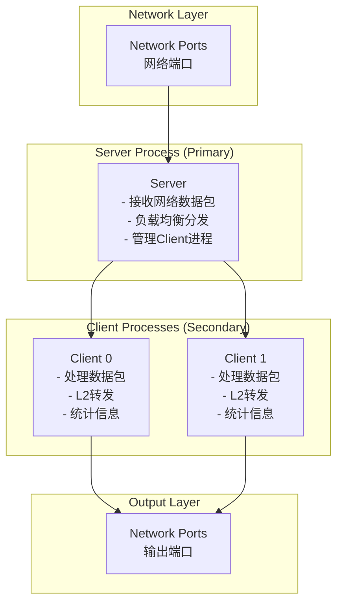
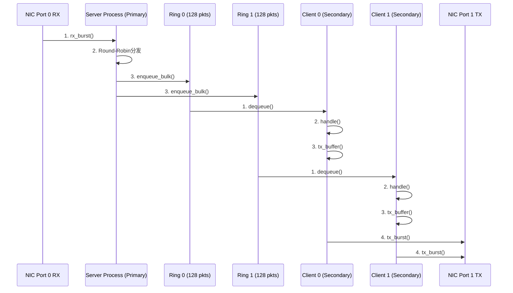
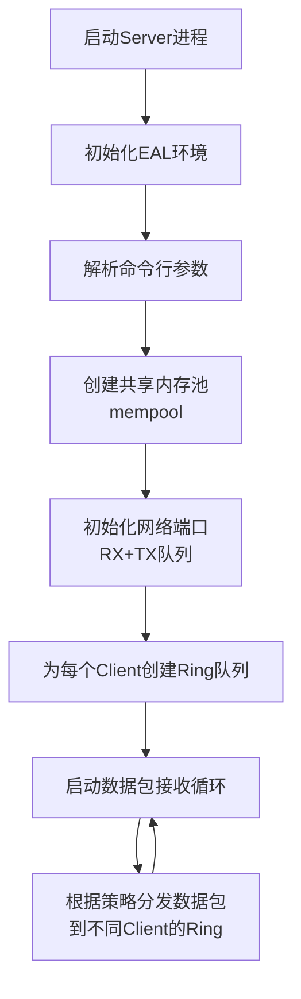
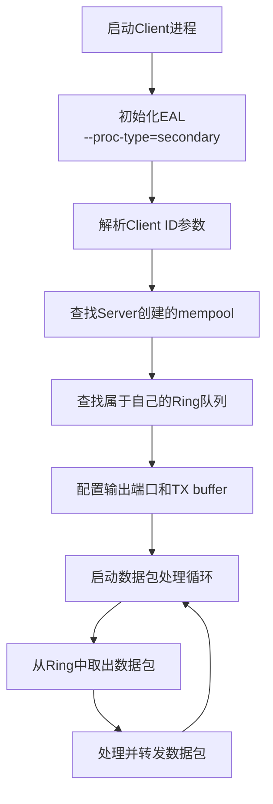

# DPDK多进程开发教程（第7课）

## 📖 课程概述

本课程将深入介绍DPDK多进程架构的核心概念和实践应用，通过学习DPDK官方的`client_server_mp`示例，掌握高性能多进程通信和数据共享机制。

| 属性 | 详情 |
|------|------|
| **课程时长** | 45分钟 |
| **难度级别** | 中级 |
| **前置知识** | 完成第1-6课，熟悉DPDK基础API、mempool、mbuf等概念 |
| **学习目标** | 掌握DPDK多进程架构设计、Ring队列通信、共享内存管理 |
| **实践项目** | 基于官方示例的Client-Server多进程架构实现 |

---

## 🏗️ 一、DPDK多进程基础理论

### 1.1 为什么需要多进程架构？

在DPDK应用开发中，多进程架构相比多线程具有以下优势：

| 特性 | 多进程 | 多线程 |
|------|--------|--------|
| **故障隔离** | ✅ 一个进程崩溃不影响其他进程 | ❌ 线程崩溃导致整个进程退出 |
| **模块化部署** | ✅ 可独立启停不同模块 | ❌ 线程强耦合 |
| **开发调试** | ✅ 可独立编译、调试各模块 | ⚠️ 调试相对复杂 |
| **性能开销** | ⚠️ 进程间通信有一定开销 | ✅ 共享地址空间，开销小 |

**典型应用场景：**

- 流水线pipeline处理架构：收包、解析、转发分离
- 热插拔模块：在线更新处理逻辑而不中断数据平面（熟悉nginx的朋友，想必都知道其master/worker模式）

### 1.2 DPDK多进程的两种角色

dpdk多进程的官网文档：https://doc.dpdk.org/guides/sample_app_ug/multi_process.html

#### 🔑 Primary进程（主进程）

**核心职责：**
- 🚀 **EAL环境初始化**：负责DPDK环境的完整初始化
- 🌐 **设备网口管理**：配置和管理所有网络设备端口
- 💾 **共享内存创建**：创建mempool、ring等共享对象
- 📋 **Hugepage管理**：负责hugepage的分配和管理
- 📊 **资源协调**：协调所有Secondary进程的资源使用

**启动参数：**
```bash
--proc-type=primary  # 默认值，可省略
```

**数量限制：**

- ⚠️ **唯一性**：一个系统中只能有一个Primary进程
- 🔒 **独占性**：拥有对网络设备的独占配置权

#### 👥 Secondary进程（从进程）

**核心职责：**
- 🔗 **共享内存**：Attach到Primary创建的共享内存
- 🔍 **对象查找**：查找并使用已存在的mempool、ring等对象
- 📦 **数据处理**：处理数据包或执行特定业务逻辑
- 🚫 **端口限制**：不能创建新的设备端口，只能使用已配置的端口

**启动参数：**
```bash
--proc-type=secondary  # 明确指定
--proc-type=auto       # 自动检测（推荐）
```

**数量限制：**

- ✅ **多实例**：可以有多个Secondary进程
- 🔄 **动态管理**：支持动态启动和停止

---

## 🏛️ 二、官方示例：Client-Server架构

### 2.1 📋 示例概述

DPDK官方提供的`client_server_mp`示例展示了一个经典的多进程架构，实现了高性能的网络数据包处理流水线。


示例多进程应用程序演示了客户端-服务器类型的多进程设计。单个服务器进程从端口接收一组数据包，并使用循环顺序将这些数据包分发给客户端进程。每个客户端处理数据包，并通过将每个数据包发送到不同的网络端口进行二级转发。


**🎯 设计目标：**

- 高吞吐量的数据包处理
- 负载均衡的多进程分发
- 故障隔离的模块化设计
- 可扩展的架构模式

**🏗️ 架构图：**



**📊 完整数据流:**




### 2.2 📁 目录结构

```
examples/multi_process/client_server_mp/
├── mp_server/              # 🔑 Server进程源码 (Primary)
│   ├── main.c             # Server主程序入口
│   ├── init.c             # 初始化函数 (端口、mempool、ring)
│   ├── args.c             # 命令行参数解析
│   └── Makefile           # Server编译配置
├── mp_client/              # 👥 Client进程源码 (Secondary)
│   ├── client.c           # Client主程序入口
│   ├── args.c             # 命令行参数解析
│   └── Makefile           # Client编译配置
├── shared/                 # 🔄 共享代码
│   ├── common.h           # 共享数据结构和宏定义
│   └── args.h             # 参数解析共享头文件
└── Makefile               # 🏗️ 整体编译配置
```

**📋 文件说明：**

| 文件/目录 | 作用 | 关键功能 |
|-----------|------|----------|
| `mp_server/main.c` | Server主程序 | 数据包接收、分发、统计 |
| `mp_server/init.c` | Server初始化 | 端口配置、共享对象创建 |
| `mp_client/client.c` | Client主程序 | 数据包处理、转发 |
| `shared/common.h` | 共享定义 | 数据结构、常量、宏定义 |

### 2.3 🔄 工作流程

#### 🚀 Server进程启动流程



#### 👥 Client进程启动流程



#### 📊 数据流转路径

```
📥 Port 0 RX → 🔄 Server → 📦 Ring[client_id] → 👥 Client → 📤 Port 1 TX
```

**🔄 详细步骤：**
1. **接收阶段**：Server从网络端口接收数据包
2. **分发阶段**：根据负载均衡策略分发给不同Client
3. **队列阶段**：数据包进入对应Client的Ring队列
4. **处理阶段**：Client从Ring中取出并处理数据包
5. **转发阶段**：处理后的数据包发送到输出端口

### 2.4 🚀 示例代码运行指南

#### 🔨 编译示例

**方法1: 使用Makefile编译 (推荐)**

```bash
# 进入示例目录
cd /path/to/dpdk-stable-24.11.1/examples/multi_process/client_server_mp

# 编译Server
cd mp_server
make
# 生成: build/mp_server

# 编译Client
cd ../mp_client
make
# 生成: build/mp_client
```


#### 🔑 运行Server进程

```bash
sudo ./mp_server/build/mp_server -l 1-2 -n 4 -- -p 0x3 -n 2
```

**📋 参数说明：**

| 参数 | 值 | 说明 |
|------|----|----|
| `-l 1-2` | CPU核心1和2 | 指定Server使用的CPU核心 |
| `-n 4` | 内存通道数 | 内存通道数量，影响内存带宽 |
| `-p 0x3` | 端口掩码 | 二进制`11`表示使用端口0和端口1 |
| `-n 2` | Client数量 | 创建2个Client的Ring队列 |

#### 👥 运行Client进程

**启动Client 0：**

```bash
sudo ./mp_client/build/mp_client -l 3 --proc-type=auto -- -n 0
```

**启动Client 1：**
```bash
sudo ./mp_client/build/mp_client -l 4 --proc-type=auto -- -n 1
```

**⚠️ 启动顺序要求：**
1. **必须先启动Server**：Primary进程负责创建共享对象
2. **再启动Client**：Secondary进程需要查找已存在的共享对象
3. **Client ID唯一**：每个Client必须有唯一的ID（0, 1, 2...）

---

## 🔧 三、核心API详解

### 3.1 🔍 进程类型相关API

#### 查询当前进程类型

```c
// 获取当前进程类型
enum rte_proc_type_t proc_type = rte_eal_process_type();

// 根据进程类型执行不同的初始化逻辑
if (proc_type == RTE_PROC_PRIMARY) {
    printf("Running as Primary process\n");
    // Primary进程的初始化逻辑
    // - 创建共享对象
    // - 配置网络端口
    // - 初始化EAL环境
} else if (proc_type == RTE_PROC_SECONDARY) {
    printf("Running as Secondary process\n");
    // Secondary进程的初始化逻辑
    // - 查找共享对象
    // - 连接到Primary进程
    // - 处理业务逻辑
} else {
    rte_exit(EXIT_FAILURE, "Invalid process type\n");
}
```

**📋 进程类型说明：**

| 类型 | 枚举值 | 说明 | 职责 |
|------|--------|------|------|
| `RTE_PROC_AUTO` | -1 | 自动检测 | 系统自动判断进程类型 |
| `RTE_PROC_PRIMARY` | 0 | 主进程 | 创建和管理共享资源 |
| `RTE_PROC_SECONDARY` | 1 | 从进程 | 使用共享资源处理业务 |
| `RTE_PROC_INVALID` | 2 | 无效类型 | 进程类型识别失败 |

### 3.2 🔄 Ring队列API（进程间通信核心）

#### 🔑 Primary进程：创建Ring

```c
#define RING_SIZE 4096  // 必须是2的幂

struct rte_ring *ring;

// 创建共享Ring队列
ring = rte_ring_create(
    "client_ring_0",              // 名称（必须唯一）
    RING_SIZE,                    // 队列大小（必须是2的幂）
    rte_socket_id(),              // NUMA节点
    RING_F_SP_ENQ | RING_F_SC_DEQ // 标志位
);
```

**📋 Ring标志位说明（DPDK 25.07+）：**

| 标志位 | 含义 | 使用场景 | 性能 |
|--------|------|----------|------|
| `RING_F_SP_ENQ` | Single Producer | 只有一个线程/进程写入 | 🚀 最高 |
| `RING_F_SC_DEQ` | Single Consumer | 只有一个线程/进程读取 | 🚀 最高 |


#### 👥 Secondary进程：查找Ring

```c
struct rte_ring *ring;

// 通过名称查找已存在的Ring
ring = rte_ring_lookup("client_ring_0");
```

#### 📤 发送数据到Ring（Server → Client）

```c
#define BURST_SIZE 32
struct rte_mbuf *tx_bufs[BURST_SIZE];
unsigned int nb_tx;

// 批量入队（返回实际入队的数量）
nb_tx = rte_ring_enqueue_burst(
    ring,                  // Ring指针
    (void **)tx_bufs,      // mbuf指针数组
    nb_pkts,               // 要发送的包数量
    NULL                   // 可选：返回剩余空间
);

// 处理入队失败的包
if (unlikely(nb_tx < nb_pkts)) {
    printf("Ring full, dropped %u packets\n", nb_pkts - nb_tx);
    for (i = nb_tx; i < nb_pkts; i++) {
        rte_pktmbuf_free(tx_bufs[i]);  // 释放未发送的包
    }
}
```

#### 📥 从Ring接收数据（Client）

```c
#define BURST_SIZE 32
struct rte_mbuf *rx_bufs[BURST_SIZE];
unsigned int nb_rx;

// 批量出队
nb_rx = rte_ring_dequeue_burst(
    ring,                  // Ring指针
    (void **)rx_bufs,      // 接收mbuf的数组
    BURST_SIZE,            // 最多接收的包数量
    NULL                   // 可选：返回剩余数量
);

// 处理接收到的包
if (nb_rx > 0) {
    printf("Dequeued %u packets from ring\n", nb_rx);
    for (i = 0; i < nb_rx; i++) {
        process_packet(rx_bufs[i]);
    }
}
```

**🔧 Ring操作最佳实践：**

| 操作 | 推荐函数 | 说明 | 性能 |
|------|----------|------|------|
| **单个入队** | `rte_ring_enqueue()` | 入队单个对象 | ⚠️ 较低 |
| **批量入队** | `rte_ring_enqueue_burst()` | 批量入队多个对象 | 🚀 推荐 |
| **单个出队** | `rte_ring_dequeue()` | 出队单个对象 | ⚠️ 较低 |
| **批量出队** | `rte_ring_dequeue_burst()` | 批量出队多个对象 | 🚀 推荐 |

### 3.3 Mempool共享

#### Primary进程：创建Mempool
```c
struct rte_mempool *pktmbuf_pool;

pktmbuf_pool = rte_pktmbuf_pool_create(
    "mbuf_pool",           // 名称
    NUM_MBUFS,             // mbuf数量
    MBUF_CACHE_SIZE,       // 每个核心的缓存大小
    0,                     // priv_size
    RTE_MBUF_DEFAULT_BUF_SIZE,  // mbuf数据区大小
    rte_socket_id()        // NUMA节点
);
```

#### Secondary进程：查找Mempool
```c
struct rte_mempool *pktmbuf_pool;

// 通过名称查找
pktmbuf_pool = rte_mempool_lookup("mbuf_pool");

if (pktmbuf_pool == NULL) {
    rte_exit(EXIT_FAILURE, "Cannot find mbuf pool\n");
}
```

### 3.4 端口访问规则

#### Primary进程：配置端口
```c
// Primary进程可以配置端口
ret = rte_eth_dev_configure(port_id, nb_rx_q, nb_tx_q, &port_conf);
ret = rte_eth_rx_queue_setup(port_id, 0, ...);
ret = rte_eth_tx_queue_setup(port_id, 0, ...);
ret = rte_eth_dev_start(port_id);
```

#### Secondary进程：使用端口
```c
// Secondary进程不能配置端口，但可以收发包
// 前提：Primary已经启动了端口

// 接收包（如果Primary配置了RX队列共享）
nb_rx = rte_eth_rx_burst(port_id, queue_id, bufs, BURST_SIZE);

// 发送包
nb_tx = rte_eth_tx_burst(port_id, queue_id, bufs, nb_pkts);
```

---

## 🔍 四、官方示例代码核心分析

### 4.1 🔑 Server端关键流程

#### 主程序流程
```c
int main(int argc, char *argv[]) {
    // 1. 初始化EAL和共享对象
    init(argc, argv);
    
    // 2. 分配Client缓冲区
    cl_rx_buf = calloc(num_clients, sizeof(cl_rx_buf[0]));
    
    // 3. 启动数据包转发主循环
    do_packet_forwarding();
    
    // 4. 清理资源
    rte_eal_cleanup();
}
```

#### 初始化关键步骤
```c
int init(int argc, char *argv[]) {
    // 1. 初始化EAL (Primary进程)
    rte_eal_init(argc, argv);
    
    // 2. 创建共享memzone
    rte_memzone_reserve(MZ_PORT_INFO, sizeof(*ports), ...);
    
    // 3. 创建mbuf内存池
    init_mbuf_pools();
    
    // 4. 初始化网络端口
    init_port(port_id);
    
    // 5. 创建Client Ring队列
    init_shm_rings();
}
```

**🔑 关键设计点：**
- **Memzone共享**：使用`rte_memzone_reserve()`创建共享结构
- **Ring队列**：为每个Client创建独立的通信队列

#### 关键实现要点

**🔧 内存池管理：**
```c
// 创建共享mbuf池
pktmbuf_pool = rte_pktmbuf_pool_create(PKTMBUF_POOL_NAME, 
    num_mbufs, MBUF_CACHE_SIZE, 0, RTE_MBUF_DEFAULT_BUF_SIZE, socket_id);
```

**🌐 端口配置：**
```c
// 配置端口：1个RX队列 + N个TX队列
rte_eth_dev_configure(port_id, 1, num_clients, &port_conf);
rte_eth_rx_queue_setup(port_id, 0, rx_ring_size, socket_id, NULL, pktmbuf_pool);
```

**🔄 Ring队列创建：**
```c
// 为每个Client创建Ring队列
clients[i].rx_q = rte_ring_create(q_name, ringsize, socket_id,
    RING_F_SP_ENQ | RING_F_SC_DEQ);
```

**📦 数据包转发：**
```c
// 主循环：接收 -> 分发 -> 转发
rx_count = rte_eth_rx_burst(port_id, 0, buf, BURST_SIZE);
process_packets(port_id, buf, rx_count);  // Round-Robin分发
rte_ring_enqueue_bulk(ring, (void**)bufs, count, NULL);  // 批量入队
```

### 4.2 👥 Client端关键流程

#### Client主程序流程
```c
int main(int argc, char *argv[]) {
    // 1. 初始化EAL (Secondary进程)
    rte_eal_init(argc, argv);
    
    // 2. 查找Server创建的共享对象
    rx_ring = rte_ring_lookup(get_rx_queue_name(client_id));
    mp = rte_mempool_lookup(PKTMBUF_POOL_NAME);
    mz = rte_memzone_lookup(MZ_PORT_INFO);
    
    // 3. 配置输出端口和TX buffer
    configure_output_ports(ports);
    
    // 4. 主循环：处理数据包
    for (;;) {
        rx_pkts = rte_ring_dequeue_burst(rx_ring, pkts, BURST_SIZE, NULL);
        for (i = 0; i < rx_pkts; i++)
            handle_packet(pkts[i]);
    }
}
```

#### 关键实现要点

**🔍 对象查找顺序：**
```c
// 1. 查找Ring队列
rx_ring = rte_ring_lookup("MProc_Client_0_RX");

// 2. 查找内存池
mp = rte_mempool_lookup("MProc_pktmbuf_pool");

// 3. 查找端口信息
mz = rte_memzone_lookup("MProc_port_info");
```

**📦 数据包处理：**

```c
// 使用TX buffer进行批量发送
sent = rte_eth_tx_buffer(out_port, client_id, tx_buffer[out_port], buf);

// 错误处理回调
rte_eth_tx_buffer_set_err_callback(buffer, flush_tx_error_callback, port_id);
```

**🔄 L2转发逻辑：**
- Port 0 ↔ Port 1 互为出口
- 每个Client使用独立的TX队列
- TX buffer实现批量发送优化

### 4.3 📊 共享数据结构设计

#### 核心数据结构
```c
// 端口信息结构 (存储在memzone中)
struct port_info {
    uint16_t num_ports;                    // 端口数量
    uint16_t id[RTE_MAX_ETHPORTS];         // 端口ID数组
    volatile struct rx_stats rx_stats;     // Server的RX统计
    volatile struct tx_stats tx_stats[MAX_CLIENTS];  // 每个Client的TX统计
};

// 统计结构 (缓存行对齐)
struct __rte_cache_aligned rx_stats {
    uint64_t rx[RTE_MAX_ETHPORTS];
};

struct __rte_cache_aligned tx_stats {
    uint64_t tx[RTE_MAX_ETHPORTS];
    uint64_t tx_drop[RTE_MAX_ETHPORTS];
};
```

#### 共享对象命名规范
```c
#define MP_CLIENT_RXQ_NAME "MProc_Client_%u_RX"    // Ring队列
#define PKTMBUF_POOL_NAME "MProc_pktmbuf_pool"     // 内存池
#define MZ_PORT_INFO "MProc_port_info"             // 端口信息
```

**🔑 设计原则：**
- **缓存行对齐**：避免False Sharing，提高性能
- **统一命名**：所有共享对象以`MProc_`前缀

---

## 🎯 五、课程总结

### 📚 核心要点

| 概念 | 说明 | 关键API |
|------|------|---------|
| **Primary进程** | 创建共享对象，配置端口 | `rte_ring_create()`, `rte_pktmbuf_pool_create()` |
| **Secondary进程** | 查找共享对象，处理数据 | `rte_ring_lookup()`, `rte_mempool_lookup()` |
| **Ring通信** | 高性能进程间通信 | `rte_ring_enqueue_burst()`, `rte_ring_dequeue_burst()` |
| **共享内存** | Hugepage映射，统一地址空间 | 基于DPDK EAL自动管理 |

### ✅ 最佳实践

- **启动顺序**：先Primary后Secondary
- **性能优化**：使用批量API，绑定CPU核心
- **错误处理**：监控Ring使用率，处理溢出情况
- **资源管理**：Primary创建，Secondary查找

### 🔗 学习资源

- [DPDK官方文档](https://doc.dpdk.org/guides/sample_app_ug/multi_process.html)
- [示例源码](https://github.com/DPDK/dpdk/tree/main/examples/multi_process)
- [API参考](https://doc.dpdk.org/api/)


